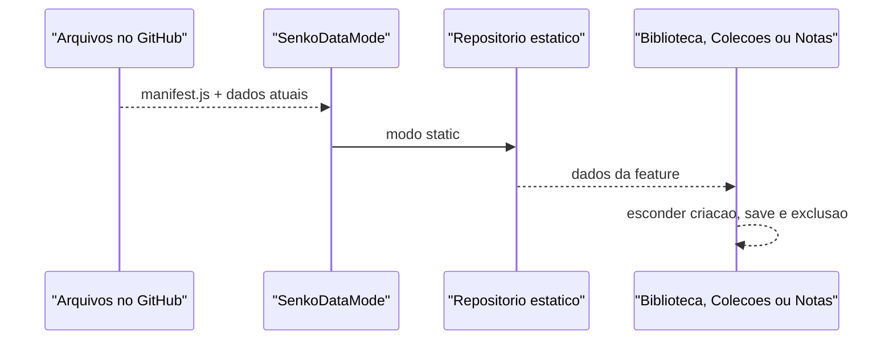
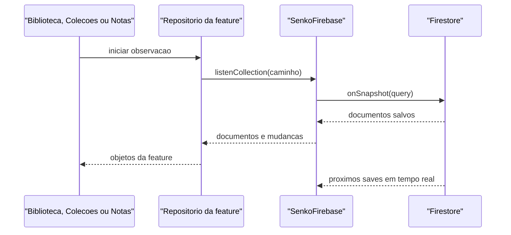
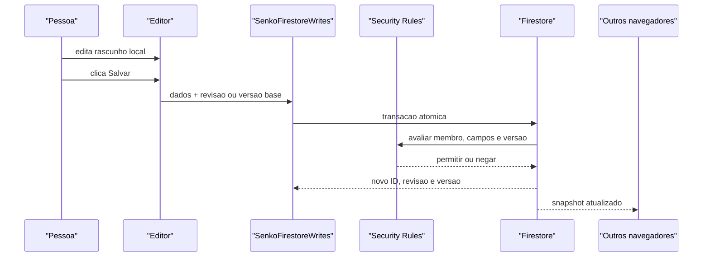
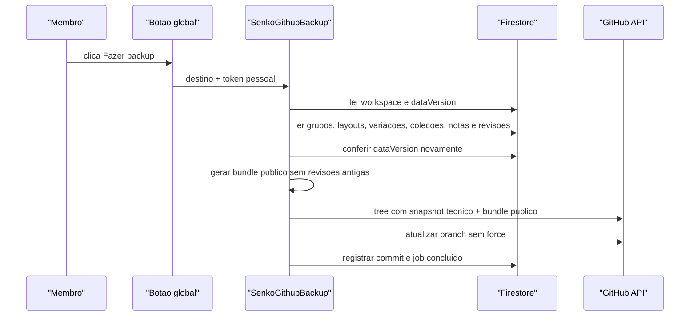

# Arquitetura Firebase do SenkoLib

## Objetivo

O Firebase e a fonte principal de Biblioteca, Colecoes e Notas da equipe. Criar, editar e
excluir altera o Firestore somente quando a pessoa confirma a operacao. O
GitHub nao participa do CRUD: ele recebe um snapshot completo quando um membro
clica no botao global de backup.

Para leitura publica, o GitHub tambem guarda uma representacao estatica da
ultima versao confirmada. Quando a sessao Firebase nao esta `ready`, Biblioteca,
Colecoes e Notas usam esse snapshot em modo somente leitura. O modo publico nao
grava, nao cria fila offline e nao substitui o Firestore como fonte principal.

Esta arquitetura foi escolhida para funcionar no plano gratuito Spark. Ela nao
depende de Cloud Functions implantadas, Cloud Scheduler, Secret Manager ou
GitHub Actions.

## Decisoes principais

- Digitar altera apenas o rascunho local.
- **Salvar** executa uma transacao no Firestore.
- Listeners do Firestore entregam o save aos outros computadores em tempo real.
- HTML e CSS usam revisao imutavel por save.
- Colecoes e grupos usam contador de versao.
- Secoes e paginas de Notas usam contador de versao e reserva de nomes.
- O template compartilhado do HTML Basico usa um singleton com contador de versao.
- Um save desatualizado falha com `aborted`; nunca ha sobrescrita silenciosa.
- Todos os documentos em `members` podem alterar conteudo. O campo `role`
  separa governanca em `owner`, `admin` e `editor`.
- Exclusao e definitiva no Firebase. A recuperacao depende de revisoes ou de
  um backup GitHub anterior.
- O backup GitHub e manual. Nenhum temporizador de 30 minutos existe.
- Cada pessoa que fizer backup usa seu proprio token GitHub de escopo minimo.
- O ultimo backup confirmado e publico e contem o HTML/CSS atual.
- Revisoes antigas ficam somente no snapshot tecnico, nao no bundle publico.
- Um servidor HTTP estatico simples consegue abrir o modo publico sem Firebase.

## Componentes

| Componente | Responsabilidade | Nao deve fazer |
| --- | --- | --- |
| Firebase Authentication | Identificar a conta Google | Conceder acesso sem um documento de membro |
| Cloud Firestore | Guardar conteudo, metadados, revisoes e logs de backup | Guardar rascunhos a cada tecla |
| Firestore Security Rules | Autorizar conteudo, cargos e formato das escritas | Confiar somente nos controles visuais |
| Realtime Database | Guardar presenca temporaria dos editores | Guardar layouts ou colecoes |
| Cloud Storage | Reserva para uma necessidade futura de arquivos | Guardar o conteudo atual sem fluxo definido |
| Firebase Hosting | Servir o aplicativo | Ser banco de dados |
| GitHub | Receber snapshot restauravel e bundle publico de leitura | Ser usado pelo CRUD normal |
| SenkoDataMode | Escolher Firebase `ready` ou backup estatico | Permitir escrita no modo publico |

`scripts/` concentra operacoes locais de administracao, backup e manutencao.
O frontend de producao nao importa o SDK de Cloud Functions.

## Arquivos principais

| Arquivo | Papel |
| --- | --- |
| `app/infrastructure/firebase/firebase-config.js` | Projeto, workspace, emuladores e destino publico do backup |
| `app/infrastructure/firebase/senko-firebase.js` | SDK, login, listeners e presenca |
| `app/infrastructure/firebase/senko-firestore-writes.js` | Validacao do cliente e transacoes de CRUD |
| `app/infrastructure/github/backup-service.js` | Snapshot Firestore e commit GitHub pelo navegador |
| `app/tools/session/register.js` | Login, conta e avisos do estado Firebase |
| `app/tools/github-backup/register.js` | Janela global do backup manual |
| `app/infrastructure/static-backup/senko-data-mode.js` | Estado global `firebase`, `static` ou `unavailable` |
| `app/infrastructure/static-backup/senko-static-backup-builder.js` | Converte o snapshot tecnico em dados publicos atuais |
| `backup/latest/manifest.js` | Metadados globais da exportacao, sem dados internos de feature |
| `backup/latest/{feature}/{manifest,data}.js` | Manifesto e payload independentes carregados pela propria feature |
| `app/features/biblioteca/repositories/firebase-repository.js` | Adaptador Firebase da Biblioteca |
| `app/features/biblioteca/repositories/static-repository.js` | Adaptador somente leitura da Biblioteca |
| `app/features/biblioteca/controllers/copy-base-editor.js` | Modal e concorrencia do HTML Basico |
| `app/features/colecoes/repositories/firebase-repository.js` | Adaptador Firebase de Colecoes e grupos |
| `app/features/colecoes/repositories/static-repository.js` | Adaptador somente leitura de Colecoes e grupos |
| `app/features/team-notes/` | Feature, repositories Firebase/static e editor de secoes e paginas |
| `app/tools/access/` | Modal global de solicitacoes, membros, cargos e atividade administrativa |
| `firebase/firestore.rules` | Autoridade de seguranca para leituras e escritas |
| `firebase/database.rules.json` | Permissoes de presenca |
| `firebase/storage.rules` | Bloqueio atual de uploads |
| `tests/firestore-client-writes.test.js` | Teste integrado das transacoes e regras |

## Limites entre camadas

`senko-firebase.js` conhece o SDK e o estado da sessao, mas nao conhece o
formato visual de layouts. Ele fornece um contexto autenticado para os modulos
de infraestrutura.

`senko-firestore-writes.js` conhece o modelo persistido. Ele valida campos,
normaliza nomes e executa transacoes. As regras repetem no servidor as
restricoes de identidade, versao, tamanho e campos permitidos. Validacao do
JavaScript melhora a mensagem de erro; Security Rules e que protegem o banco.

Cada feature possui adaptadores independentes para Firebase e para o snapshot
estatico. Ambos entregam o formato que a interface entende; a interface nao
monta caminhos Firestore nem interpreta os arquivos gerados.

`app/infrastructure/github/backup-service.js` e infraestrutura separada. Uma falha do GitHub nao
desfaz nem impede um save que ja ocorreu no Firestore.

## Inicializacao

1. `index.html` carrega o bundle do ultimo backup e `firebase-config.js`.
2. `senko-firebase.js` importa o SDK modular e inicializa os produtos.
3. `SenkoDataMode` disponibiliza imediatamente o snapshot como `static`.
4. Em localhost, os SDKs apontam para os emuladores.
5. `onAuthStateChanged` observa o login e acompanha o documento de membro.
6. Somente um membro existente muda o Firebase para `ready`.
7. `SenkoDataMode` muda para `firebase` e as features substituem o snapshot
   por listeners ao vivo.
8. Ao sair da conta ou perder a inicializacao Firebase, as features voltam ao
   snapshot estatico e bloqueiam comandos de escrita.

O cargo tambem e acompanhado em tempo real. Promover ou remover uma pessoa
atualiza a disponibilidade da ferramenta global `Acessos` sem exigir novo
login. Ela aparece no menu para `owner` e `admin` e abre em modal, sem ocupar
uma aba de conteudo.

## Cargos

| Cargo | Conteudo | Pessoas |
| --- | --- | --- |
| `owner` | Cria, edita, exclui e faz backup | Aprova qualquer cargo, altera cargos e remove outros membros |
| `admin` | Cria, edita, exclui e faz backup | Aprova, sincroniza e remove somente editores |
| `editor` | Cria, edita, exclui e faz backup | Nao lista solicitacoes nem membros |

Um proprietario nao pode alterar ou remover a propria conta. Para transferir o
cargo, primeiro promove outra pessoa; o novo proprietario pode rebaixar o
anterior. Isso impede que o aplicativo fique sem proprietario.

`owner` do SenkoLib nao e o papel Owner do Google Cloud IAM. Acesso ao Console
Firebase continua sendo concedido separadamente pelo Console.

Estados esperados:

| Estado | Significado |
| --- | --- |
| `disabled` | Firebase desligado; snapshot publico quando disponivel |
| `loading` | SDK sendo carregado |
| `signed-out` | Firebase ativo sem login |
| `checking-access` | Conta autenticada, membro em verificacao |
| `unauthorized` | Conta valida sem acesso ao workspace |
| `ready` | Conta autenticada e membro autorizado |
| `error` | Falha de configuracao, SDK, rede ou regras |

O estado tambem pode carregar `serviceIssue`, classificado como `quota`,
`offline`, `unavailable` ou `error`. Falhas de cota e conexao recebidas por um
listener ou por um salvamento retiram o app do estado `ready`, ativam o backup
somente leitura e exibem um aviso persistente no header. O botao **Tentar
novamente** recarrega a aplicacao; nenhuma tentativa automatica fica consumindo
leituras durante o incidente.

Uma falha em colecao exclusiva pode declarar `errorScope: 'feature'`. Nesse
caso, somente a dona mostra o erro e usa seu snapshot; o estado global e as
demais features continuam no Firebase. Notas usa esse escopo para que regras
ou permissoes proprias nao mantenham um alerta global depois de sair da tela.

Estados de dados do aplicativo:

| Estado | Fonte | Escrita |
| --- | --- | --- |
| `firebase` | Firestore e listeners ao vivo | Permitida para membro |
| `static` | Ultimo bundle gerado pelo backup | Bloqueada |
| `unavailable` | Nenhuma fonte carregada | Bloqueada e tela de erro/login |

## Fluxo de leitura publica



O bundle publico contem HTML e CSS porque a proposta do SenkoLib e permitir
consulta e copia desse codigo. Ele nao contem membros, e-mails, presenca,
tokens, logs ou revisoes antigas.

## Fluxo de leitura



O listener nao publica o que outra pessoa ainda esta digitando. Ele publica o
estado confirmado assim que essa pessoa clica em **Salvar**.

## Fluxo de salvamento



Uma transacao de conteudo grava junto:

1. recurso atual;
2. nova revisao, quando houver HTML/CSS;
3. reserva do nome normalizado;
4. incremento de `workspace.dataVersion`.

O `dataVersion` permite detectar uma mudanca no meio da leitura do backup.

## Concorrencia

Conteudo HTML/CSS usa `currentRevisionId`. Colecoes, grupos, o singleton do
HTML Basico, secoes e paginas de Notas usam `version`.
O editor guarda a base recebida ao abrir o item e a envia no save.

- Base atual: a transacao grava a nova versao.
- Base antiga: o cliente retorna `functions/aborted`.
- Editor local limpo: uma atualizacao remota pode aparecer imediatamente.
- Editor com protecao de rascunho: o texto local e preservado e a interface
  avisa o conflito.

Nao existe merge automatico de HTML ou CSS. A pessoa compara e decide.

Limite atual de Notas: a transacao recusa `expectedVersion` antigo, mas o
listener ainda pode recarregar o editor e substituir visualmente um rascunho
nao salvo. Preservar esse rascunho antes de aplicar o snapshot e uma melhoria
pendente.

## Nomes unicos

O nome e normalizado sem acentos, em minusculas e com espacos uniformes. O ID
da reserva e SHA-256 de `escopo:nameKey`.

Exemplos de escopo:

- `biblioteca-layouts`;
- `biblioteca-variantes:{layoutId}`;
- `team-note-sections`;
- `team-note-pages:{sectionId}`;
- `colecoes`;
- `colecao-layouts:{collectionId}`;
- `grupos`.

A transacao consulta a reserva antes de salvar. As regras garantem que somente
membros escrevam a colecao, mas nao conseguem recalcular SHA-256. Por isso os
membros sao tratados como editores confiaveis; um membro mal-intencionado que
altere o JavaScript poderia burlar apenas essa convencao de unicidade.

## Exclusao

Conteudo versionado e colecoes usam duas fases:

1. uma transacao confere a base, marca `deleting: true`, remove a reserva e
   incrementa `dataVersion`;
2. lotes removem revisoes, filhos e o documento principal.

Excluir um layout da Biblioteca remove tambem variacoes e revisoes. Excluir
uma colecao remove layouts internos e revisoes.

Grupos so podem ser excluidos quando a consulta do cliente nao encontra
colecoes usando o `groupId`. Como o plano Spark nao possui backend proprio,
essa verificacao nao e uma garantia contra um membro que modifique o codigo.
Para o modelo atual de membros confiaveis, o risco foi aceito e documentado.

## Presenca

A presenca usa:

```text
presence/{workspace}/{resourceType}/{resourceId}/{uid}/{sessionId}
```

Cada aba possui um `sessionId`. `onDisconnect().remove()` limpa a sessao quando
a conexao cai. `presenceAccess/{workspace}/{uid} = true` autoriza o Realtime
Database. `memberManagers/{workspace}/{uid}` guarda somente `owner` ou `admin`
para autorizar a sincronizacao de `presenceAccess` pela tela administrativa.

No emulador, uma Function local cria o primeiro acesso. Em producao Spark, o
modal `Acessos` grava Firestore e Realtime Database ao aprovar, promover ou
remover uma pessoa. As duas gravacoes nao sao uma transacao unica; se a segunda
falhar, a tela mostra aviso e oferece **Sincronizar**.

## Fluxo do backup



O token fica em `localStorage` do navegador que o configurou. Ele nunca entra
no repositorio, Firebase ou snapshot. O destino oficial do commit vem de
`app/infrastructure/firebase/firebase-config.js`; configuracao antiga no
`localStorage` nao pode mandar o snapshot para outro repositorio quando
`githubBackup` esta definido. Use um fine-grained personal access token
limitado a `YgorFQ/projetoTestes` e permissao `Contents: Read and write`.

## Ambientes apos o corte

Atualmente `firebase-config.js` deixa Firebase ativo em producao e separa
somente o uso de emuladores:

- `localhost` e `127.0.0.1`: Firebase ativo usando emuladores;
- GitHub Pages e outros hosts autorizados: Firebase ativo no projeto real;
- sem sessao `ready`: bundle do ultimo backup em modo somente leitura;
- o Git preserva implementacoes removidas sem mante-las no runtime atual.

Qualquer novo ambiente publico precisa ser adicionado aos dominios autorizados
do Firebase Authentication antes do login funcionar.
