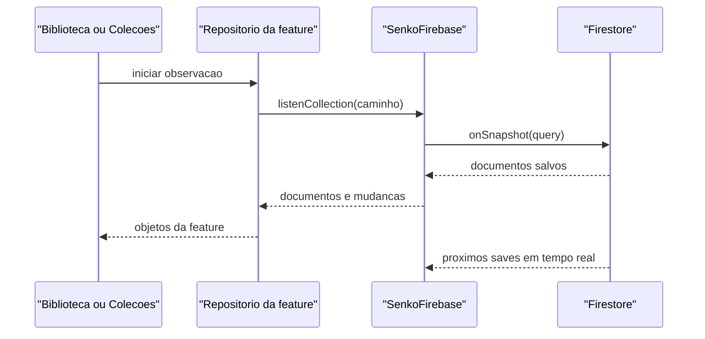
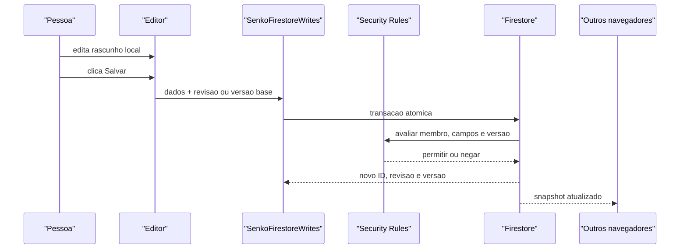
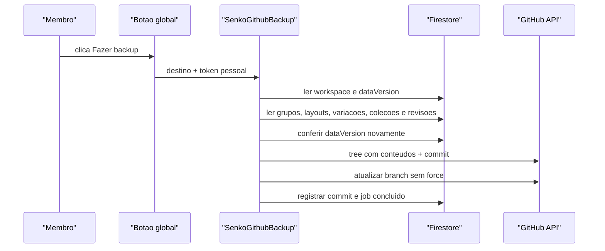

# Arquitetura Firebase do SenkoLib

## Objetivo

O Firebase e a fonte principal de Biblioteca e Colecoes. Criar, editar e
excluir altera o Firestore somente quando a pessoa confirma a operacao. O
GitHub nao participa do CRUD: ele recebe um snapshot completo quando um membro
clica no botao global de backup.

Esta arquitetura foi escolhida para funcionar no plano gratuito Spark. Ela nao
depende de Cloud Functions implantadas, Cloud Scheduler, Secret Manager ou
GitHub Actions.

## Decisoes principais

- Digitar altera apenas o rascunho local.
- **Salvar** executa uma transacao no Firestore.
- Listeners do Firestore entregam o save aos outros computadores em tempo real.
- HTML e CSS usam revisao imutavel por save.
- Colecoes e grupos usam contador de versao.
- Um save desatualizado falha com `aborted`; nunca ha sobrescrita silenciosa.
- Todos os documentos em `members` representam editores confiaveis e possuem
  as mesmas permissoes de conteudo.
- Exclusao e definitiva no Firebase. A recuperacao depende de revisoes ou de
  um backup GitHub anterior.
- O backup GitHub e manual. Nenhum temporizador de 30 minutos existe.
- Cada pessoa que fizer backup usa seu proprio token GitHub de escopo minimo.

## Componentes

| Componente | Responsabilidade | Nao deve fazer |
| --- | --- | --- |
| Firebase Authentication | Identificar a conta Google | Conceder acesso sem um documento de membro |
| Cloud Firestore | Guardar conteudo, metadados, revisoes e logs de backup | Guardar rascunhos a cada tecla |
| Firestore Security Rules | Autorizar membros e validar o formato das escritas | Administrar membros pelo frontend |
| Realtime Database | Guardar presenca temporaria dos editores | Guardar layouts ou colecoes |
| Cloud Storage | Reserva para uma necessidade futura de arquivos | Guardar o conteudo atual sem fluxo definido |
| Firebase Hosting | Servir o aplicativo | Ser banco de dados |
| GitHub | Receber snapshots restauraveis | Ser usado pelo CRUD normal |

`functions/` continua no repositorio porque contem importadores, restauracao,
testes e a implementacao anterior. No plano Spark, o frontend de producao nao
depende dessas Functions.

## Arquivos principais

| Arquivo | Papel |
| --- | --- |
| `app/infrastructure/firebase/firebase-config.js` | Projeto, workspace, emuladores e destino publico do backup |
| `app/infrastructure/firebase/senko-firebase.js` | SDK, login, listeners e presenca |
| `app/infrastructure/firebase/senko-firestore-writes.js` | Validacao do cliente e transacoes de CRUD |
| `app/infrastructure/firebase/senko-github-backup.js` | Snapshot Firestore e commit GitHub pelo navegador |
| `app/infrastructure/firebase/senko-firebase-ui.js` | Login, conta e janela do backup global |
| `app/features/biblioteca/data/firebase-repository.js` | Adaptador Firebase da Biblioteca |
| `app/features/colecoes/data/firebase-repository.js` | Adaptador Firebase de Colecoes e grupos |
| `firestore.rules` | Autoridade de seguranca para leituras e escritas |
| `database.rules.json` | Permissoes de presenca |
| `storage.rules` | Bloqueio atual de uploads |
| `tests/firestore-client-writes.test.js` | Teste integrado das transacoes e regras |

## Limites entre camadas

`senko-firebase.js` conhece o SDK e o estado da sessao, mas nao conhece o
formato visual de layouts. Ele fornece um contexto autenticado para os modulos
de infraestrutura.

`senko-firestore-writes.js` conhece o modelo persistido. Ele valida campos,
normaliza nomes e executa transacoes. As regras repetem no servidor as
restricoes de identidade, versao, tamanho e campos permitidos. Validacao do
JavaScript melhora a mensagem de erro; Security Rules e que protegem o banco.

Cada `firebase-repository.js` converte entre o documento Firestore e o objeto
que a feature antiga entende. A interface nao deve montar caminhos Firestore.

`senko-github-backup.js` e infraestrutura separada. Uma falha do GitHub nao
desfaz nem impede um save que ja ocorreu no Firestore.

## Inicializacao

1. `index.html` carrega `firebase-config.js`.
2. `senko-firebase.js` importa o SDK modular e inicializa os produtos.
3. Em localhost, os SDKs apontam para os emuladores.
4. `onAuthStateChanged` observa o login.
5. A infraestrutura le `workspaces/{workspaceId}/members/{uid}`.
6. Somente um documento existente muda o estado para `ready`.
7. As features iniciam listeners e liberam a interface.

Estados esperados:

| Estado | Significado |
| --- | --- |
| `disabled` | Firebase desligado; modo legado temporario |
| `loading` | SDK sendo carregado |
| `signed-out` | Firebase ativo sem login |
| `checking-access` | Conta autenticada, membro em verificacao |
| `unauthorized` | Conta valida sem acesso ao workspace |
| `ready` | Conta autenticada e membro autorizado |
| `error` | Falha de configuracao, SDK, rede ou regras |

## Fluxo de leitura



O listener nao publica o que outra pessoa ainda esta digitando. Ele publica o
estado confirmado assim que essa pessoa clica em **Salvar**.

## Fluxo de salvamento



Uma transacao de conteudo grava junto:

1. recurso atual;
2. nova revisao, quando houver HTML/CSS;
3. reserva do nome normalizado;
4. incremento de `workspace.dataVersion`.

O `dataVersion` permite detectar uma mudanca no meio da leitura do backup.

## Concorrencia

Conteudo HTML/CSS usa `currentRevisionId`. Colecoes e grupos usam `version`.
O editor guarda a base recebida ao abrir o item e a envia no save.

- Base atual: a transacao grava a nova versao.
- Base antiga: o cliente retorna `functions/aborted`.
- Editor local limpo: uma atualizacao remota pode aparecer imediatamente.
- Editor com rascunho: o rascunho e preservado e a interface avisa o conflito.

Nao existe merge automatico de HTML ou CSS. A pessoa compara e decide.

## Nomes unicos

O nome e normalizado sem acentos, em minusculas e com espacos uniformes. O ID
da reserva e SHA-256 de `escopo:nameKey`.

Exemplos de escopo:

- `biblioteca-layouts`;
- `biblioteca-variantes:{layoutId}`;
- `colecoes`;
- `colecao-layouts:{collectionId}`;
- `grupos`.

A transacao consulta a reserva antes de salvar. As regras garantem que somente
membros escrevam a colecao, mas nao conseguem recalcular SHA-256. Por isso os
membros sao tratados como editores confiaveis; um membro mal-intencionado que
altere o JavaScript poderia burlar apenas essa convencao de unicidade.

## Exclusao

Conteudo versionado e colecoes usam duas fases:

1. uma transacao confere a base, marca `deleting: true`, remove a reserva e
   incrementa `dataVersion`;
2. lotes removem revisoes, filhos e o documento principal.

Excluir um layout da Biblioteca remove tambem variacoes e revisoes. Excluir
uma colecao remove layouts internos e revisoes.

Grupos so podem ser excluidos quando a consulta do cliente nao encontra
colecoes usando o `groupId`. Como o plano Spark nao possui backend proprio,
essa verificacao nao e uma garantia contra um membro que modifique o codigo.
Para o modelo atual de membros confiaveis, o risco foi aceito e documentado.

## Presenca

A presenca usa:

```text
presence/{workspace}/{resourceType}/{resourceId}/{uid}/{sessionId}
```

Cada aba possui um `sessionId`. `onDisconnect().remove()` limpa a sessao quando
a conexao cai. `presenceAccess/{workspace}/{uid} = true` autoriza o Realtime
Database.

No emulador, uma Function local cria esse acesso. Em producao Spark, o acesso
de presenca precisa ser cadastrado administrativamente junto do membro. Se ele
nao existir, CRUD e listeners do Firestore continuam funcionando; somente o
indicador de pessoas no editor fica indisponivel.

## Fluxo do backup



O token fica em `localStorage` do navegador que o configurou. Ele nunca entra
no repositorio, Firebase ou snapshot. Use um fine-grained personal access token
limitado a `YgorFQ/projetoTestes` e permissao `Contents: Read and write`.

## Modo legado durante a transicao

Atualmente `firebase-config.js` ativa Firebase somente em localhost:

- `localhost` e `127.0.0.1`: Firebase e emuladores;
- outros hosts: Firebase desligado e comportamento legado ainda disponivel.

Antes do corte real, publique regras e dados, cadastre membros e altere a
ativacao de producao. Consulte `MIGRATION_STATUS.md` e `OPERATIONS.md`.
